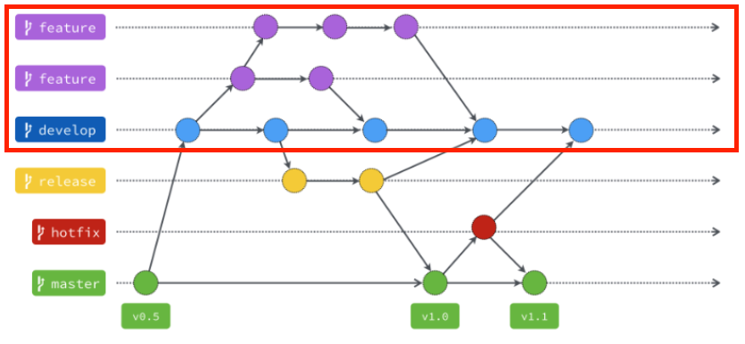
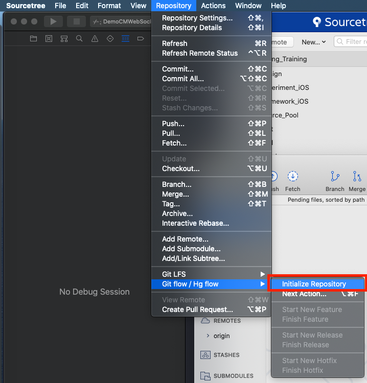
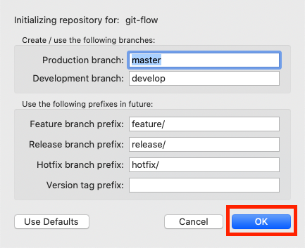

# Git Flow 開發方式

## 為什麼要有 Git Flow ?

**一**群人共同開發專案，需要一套規則\(workflow\)才可以讓大家有效率的開發，如果每個人的習慣不同，很容易產生各種問題，而Git Flow只是其中的一套規則。

## Git Flow 的基本規則

Git Flow有主要的分支有 Master、Develop、Hotfix、Release 以及 Feature 這五種分支，Master、Develop屬於長期分支，其他分支會因任務結束而被刪除。

* Ｍaster: 主要放穩定隨時可上線的版本，此分支只能從別的分支合併過來，開發者不能Commit到這個分支，通常會加上版本號標籤。
* Develop & Feature: Develop是所有開發的基礎分支，當要新增功能的時，新增Feature從此分支出去。而分支的功能完成後，也都會合併回來這個分支。
* Release & Hotfix:  測試階段和修正緊急問題用的分支，目前少機率用到。

## 操作指南

1. 建立master\(順便付Gitignore檔\) &lt; ---- 會幫你們弄
2. 建立branch，並命名為"develop" &lt; ---- 會幫你們弄
3. 利用 SourceTree &gt; Repository &gt; Git flow &gt; Initialize Repository，來初始化
4. 利用 SourceTree &gt; Repository &gt; Git flow &gt; Start New Feature，開新的feature分支
5. 在新的feature分支，開始建立專案或是修改程式碼等等
6. 一旦有小功能完成，請立即Commit並Push，請不要一大包功能上傳!!!
7. 一旦feature完成，例如登入頁完成，找核心組或關主驗收功能，然後發 Merge Requests\(

   核心組或關主會教\)

8. 利用 SourceTree &gt; Repository &gt; Git flow &gt; Finish Feature，合併回develop，再發動Push才算完成\(下專案自行操作\)
9. 然後重複3~7的工作項目。

