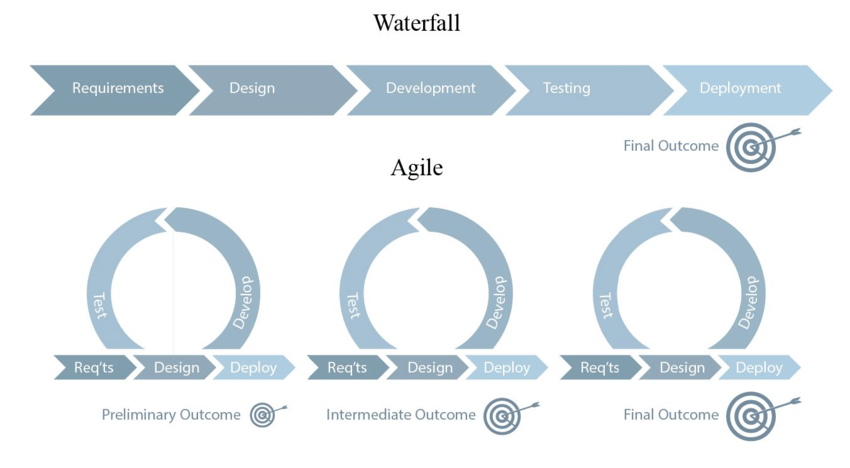

# Scrum 基本知識

## 在理解 Scrum 之前，先理解什麼是 Agile\(敏捷開發\)?

* Agile 述說的是一種精神或是哲學
* 重點是"快速疊代"、"快速回饋"
* 沒有回饋就沒有敏捷 !!!

## Waterfall vs Agile 

* Waterfall = 按照完整計畫進行 =&gt; 給客戶合約上的東西
* Agile = 小增量、反覆運算、回饋 =&gt; 給客戶有價值的東西

## 什麼是Scrum?

* Scrum是敏捷開發方法的其中之一種方法

## 如何執行Scrum?

Scrum 三個主要元素

* 角色（roles）
  * Product Owner（PO，產品負責人）: 與開發團隊合作一起定義產品需求，負責產品成敗
  * Scrum Master（SM，Scrum大師）: 協助團隊持續改善開發流程
  * Developer（開發人員）: 跨職能團隊的開發軟體
* 活動（activities）
  * Sprint：為期 2-4 週的開發活動
  * Planning meeting: 在每個 sprint 開發活動的第一天，確認需求與開單\(1hr\)
  * Daily meeting: 每日會議\(10min\)
  * Review meeting: 回饋會議\(1~2hr\)
* 產出物（artifacts）
  * UserStory: 有記錄需求與驗收項目\(藍單\)
  * Task: 工作項目\(黃單\)
  * Burndown chart: 燃盡圖

## 使用TFS工具幫助我們跑Scrum

直接操作給你們看吧!!!

## 參考網址

* \[Scrum 指南\(Scrum之父寫的\)\] [https://scrumguides.org/docs/scrumguide/v2020/2020-Scrum-Guide-Chinese-Traditional.pdf](https://scrumguides.org/docs/scrumguide/v2020/2020-Scrum-Guide-Chinese-Traditional.pdf)
* \[91APP 電商技術大解密 \(2020 線上分享系列\)：DevOps 的金字塔原理與技術\] [https://m.youtube.com/watch?v=iAbnXE7uvEA](https://m.youtube.com/watch?v=iAbnXE7uvEA)

