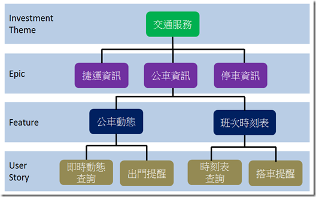

# Scrum 基本知識

## 在理解 Scrum 之前，先理解什麼是 Agile?

Waterfall (瀑布式開發) vs Agile (敏捷式開發)

* Waterfall = 按照完整計畫進行 => 給客戶合約上的東西
* Agile = 小增量、反覆運算、回饋 => 給客戶有價值的東西


* Agile 述說的是一種精神或是哲學
* 重點是"快速疊代"、"快速回饋"
* 沒有回饋就沒有敏捷 !!!


## 什麼是Scrum?

* Scrum是敏捷開發方法的其中之一種方法

## 如何執行Scrum?

Scrum 三個主要元素

* 角色（roles）
  * Product Owner（PO，產品負責人）: 與開發團隊合作一起定義產品需求，負責產品成敗
  * Scrum Master（SM，Scrum大師）: 協助團隊持續改善開發流程
  * Developer（開發人員）: 跨職能團隊的開發軟體
* 活動（activities）
  * Sprint：為期 2-4 週的開發活動
  * Planning meeting: 在每個 sprint 開發活動的第一天，確認需求與開單(1hr)
  * Daily meeting: 每日會議(10min)
  * Review meeting: 回饋會議(1\~2hr)
* 產出物（artifacts）
  * Epic、Feature、UserStory: 由大到小記錄需求與驗收項目&#x20;
  * Task: 工作項目(包含估時)
  * Burn down chart: 燃盡圖

## 提倡精神

* 為什麼要跑敏捷？
  * 程式的素養 -> Building the thing right 做出好的產品(重點：速度和品質)
  * 敏捷的素養 -> Building the right thing 做出正確的產品(重點：方向)
* Scrum Teams 是跨職能（cross-functional）
* 沒有絕對的規則 => 每個團隊適合的規則不同
* 沒有絕對的產品 => 用戶才是根本
* 多多用團隊的力量解決問題
* Agile 的本質是"替用戶解決真正問題"，精神還是老話一句 "快速疊代"、"快速回饋"

## 使用TFS工具幫助我們跑Scrum

直接操作給你們看吧!!!

## 參考網址

* \[Scrum 指南(Scrum之父寫的)] [https://scrumguides.org/docs/scrumguide/v2020/2020-Scrum-Guide-Chinese-Traditional.pdf](https://scrumguides.org/docs/scrumguide/v2020/2020-Scrum-Guide-Chinese-Traditional.pdf)

